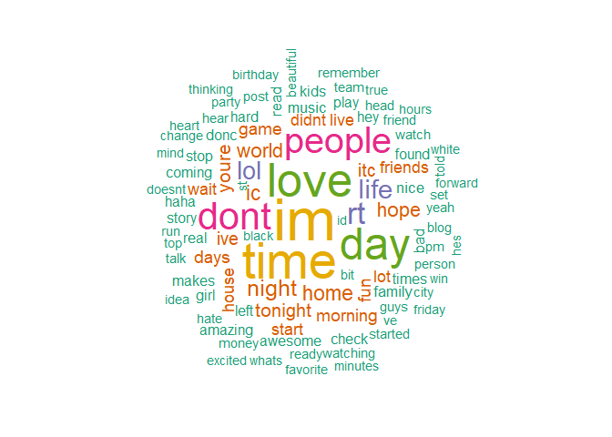

```
## Warning: package 'tidytext' was built under R version 3.5.3
```

```
## Warning: package 'tidyverse' was built under R version 3.5.3
```

```
## Warning: package 'tibble' was built under R version 3.5.3
```

```
## Warning: package 'tidyr' was built under R version 3.5.3
```

```
## Warning: package 'readr' was built under R version 3.5.3
```

```
## Warning: package 'purrr' was built under R version 3.5.3
```

```
## Warning: package 'dplyr' was built under R version 3.5.3
```

```
## Warning: package 'stringr' was built under R version 3.5.3
```

```
## Warning: package 'forcats' was built under R version 3.5.3
```

```
## Warning: package 'knitr' was built under R version 3.5.3
```

```
## Warning: package 'wordcloud' was built under R version 3.5.3
```

```
## Warning: package 'RColorBrewer' was built under R version 3.5.2
```

```
## Warning: package 'ngram' was built under R version 3.5.2
```


## Introduction   
This project analyzes the [HC Corpora Dataset](https://d396qusza40orc.cloudfront.net/dsscapstone/dataset/Coursera-SwiftKey.zip) with the end goal of creating a Shiny App for predicting n-grams.  This first milestone report summarizes an exploratory data analysis.

## File Summary   
Three data files sourced from blogs, news, and twitter were read into R.  The news file had hidden null characters preventing a full file read and these null characters required hand deletion with Notepad++ prior to file loading. 

f_names      f_size   f_lines      n_char    n_words   pct_n_char   pct_lines   pct_words
--------  ---------  --------  ----------  ---------  -----------  ----------  ----------
blogs      200.4242    899288   208361438   37334131         0.54        0.27        0.53
news       196.2775     77259    15683765    2643969         0.04        0.02        0.04
twitter    159.3641   2360148   162385035   30373583         0.42        0.71        0.43
  
Processing files of this size pushed up against R's memory limits and ran slowly. To facilitate analysis, we sampled ten percent of the lines from each file. We cleaned the sample and created n-grams. To further speed processing, we subsetted the n-grams to those that covered 90% of the sample phrases.  A fully reproducible version of this data analysis is available on [Github.](https://github.com/mark-blackmore/JHU-Data-Science-Capstone/blob/master/02_Task_Script.md)

## Uni-grams  
The corpora are populated with many acronyms and abbreviations such as "rt" for re-tweet, "lol" for laugh out loud, "ic" for I see. Notably, we chose to leave the short hand "im" for I am and "dont" for don't / do not as is, hence they show up as uni-grams.  

### Uni-gram Wordcloud  
Word distribution can be summarized with a word cloud, where word size/color represents frequency. The words, "im", and "time" show up as most frequent followed by "people", "dont", "day", and "love". This is a popular visual method, but we prefer the relative frequency column plots shown below.  
<!-- -->

### Uni-grms, By Source  
The different files - blogs, news, twitter - had different word relative frequencies. Notice that in terms of most frequent words, "rt" occurs only on twitter, "ic" and "donc" only in blogs, and "city", "percent", "county" only in news. 
<!-- -->

## Uni-gram Distribution
Distributions were created for each set of n-grams, based on relative frequency.

<!-- -->


## Bi-gram Distribution
<!-- -->

## Tri-gram Distribution
<!-- -->

## Quad-gram Distribution
<!-- -->

## N-gram Prediction Model

I anticipate using the n-gram tables created for bi-gram, tri-grams, and quad-grams as the basis for prediction.  The user will input a word, the model will find the bi-gram with the greatest relative frequency given that word.  Similarly, the tri-gram table will be used for making predictions from two word entries and so on.  


word1    word2   word3   word4      n   proportion    coverage
-------  ------  ------  ------  ----  -----------  ----------
the      end     of      the      525     8.43e-05   0.0000843
the      rest    of      the      478     7.68e-05   0.0001611
at       the     end     of       420     6.74e-05   0.0002285
for      the     first   time     379     6.09e-05   0.0002894
is       going   to      be       370     5.94e-05   0.0003488
thanks   for     the     rt       359     5.77e-05   0.0004065

Notice in the guad-gram table, that the 4-grams are separated by word and arranged by relative frequency. When the user inputs three words, the model matches those words and then finds the fourth word with the greatest relative frequency.  Cases where there is no match, or where more than three words are entered, will have random completion.
